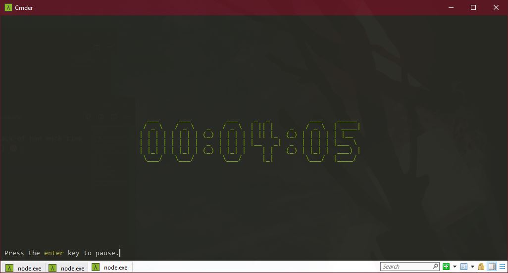

# time.io
Time.IO is supposed to be a tool to help you keep track of how much time you spend on doing something (coding, learning, etc.) 🤔.



## Installation
```npm i -g time.io```

## Usage
```time-io```

## Available Commands
* ```create <name>``` Creates a project with the specified name
* ```delete <name>``` Deletes a project with all its data (use with caution)
* ```list``` Lists all projects
* ```use <name>``` Switch to a project with the specified name
* ```info``` Prints info about a project (a project must be selected with ```use```)
* ```start``` Start the timer (You can press enter to stop it after starting it) (a project must be selected with ```use```)
* ```info <formatter>``` Prints data about the currently selected project, See [formatters](#formatters) below.
* ```clear``` Clears the terminal screen
* ```help``` Prints all available commands
* ```exit``` Exits


<!-- * ```rangeinfo <formatter> <start> <finish>``` The same as ```info``` but limits the data to the specified range. (COMING SOON) -->
## Command Aliases
| Command      | Aliases                           |
| ---          | ---                               |
| ```create``` | ```c```                           |
| ```delete``` | ```remove```, ```rm```, ```del``` |
| ```list```   | ```ls```, ```l```                 |
| ```use```    | ```u```                           |
| ```start```  | ```s```                           |
| ```clear```  | ```cls```                         |
| ```help```   | ```h```                           |

## <a name="formatters"></a> Formatters
* ```day``` Groups the output data by days


* ```month``` Groups the output data by months


* ```year``` Groups the output data by years


## Notes
* The timer saves your data every 3 minutes and when you stop it
* Do not run multiple timers on the same project as it will create a message in the data file

Don't judge the half-assed functional code I'm still learning functional programming and it's pretty hard 😥

Thanks